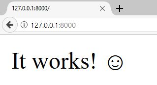
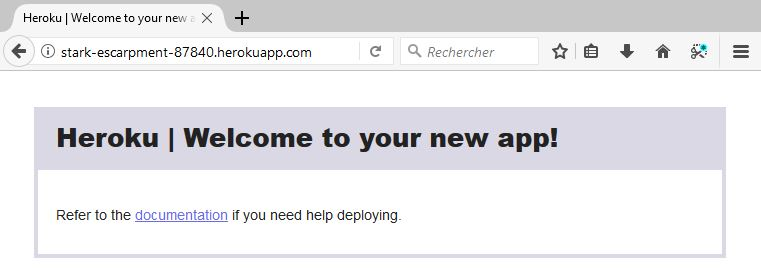
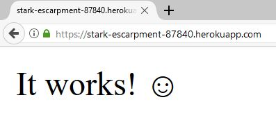
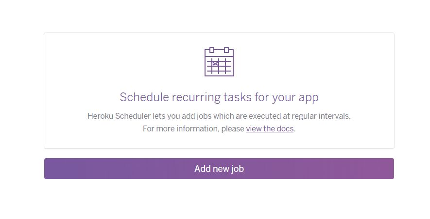
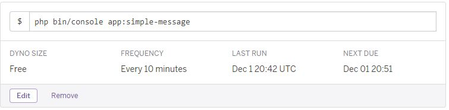

# Déployer un projet Symfony Flex sur Heroku

Nous allons aborder trois sujets ici :

* Qu'est-ce que Flex ?
* Heroku, c'est quoi ?
* Créons notre projet et déployons-le !

## Qu'est-ce que Flex ?

Flex, parfois appelé Symfony Flex, est un plugin Composer que vous pouvez installer dans tout projet PHP, et qui va
permettre de standardiser la structure et la composition d'un projet.

D'autres articles existent à ce propos, notamment dans le cadre de ce calendrier de l'avent, et je ne vais donc pas trop
m'étaler sur le sujet.

En quelques phrases, je peux vous dire que Flex :

* Permet d'utiliser certains alias pour installer un ou plusieurs packages (comme `cli` pour `symfony/console`, ou
`orm` pour plusieurs packages relatifs à l'ORM Doctrine).
* Permet d'automatiser la configuration par défaut d'un package via des "recettes" (`recipe`) pouvant être définies dans
les repositories publics [symfony/recipes-contrib](https://github.com/symfony/recipes-contrib) et
[symfony/recipes](https://github.com/symfony/recipes)
* Grâce à la nouvelle structure de Symfony 4 & Flex, standardise totalement la structure d'un projet PHP ainsi que
l'utilisation de variables d'environnement et de scripts composer automatisés.

## Heroku, c'est quoi ?

C'est une plateforme permettant de faire du cloud-computing.

On peut l'utiliser pour héberger des bases de données, des applications (web, workers, etc.), et les orchestrer.

Sa configuration peut être faite via l'utilisation d'une ligne de commande, ou par un tableau de bord en ligne, les deux
étant facilement accessibles.

### Prix

Heroku est payant mais propose un accès gratuit jusqu'à un certain nombre d'heures d'utilisation. Dans le cas d'une
application web, celle-ci rentre dans un état de "sommeil" après 30 minutes d'activité, permettant d'économiser le temps
disponible. La formule gratuite est par conséquent très pratique pour les prototypes ou les environnements
d'intégration continue.

Pour le reste, le prix dépend des performances que vous souhaitez, des add-ons que vous utilisez, et surtout du temps
d'utilisation.

Par exemple, un abonnement `Hobby` à $7 par mois vous coûtera seulement $3.50 si vous l'utilisez 15 jours et le
désactivez ensuite. C'est très important à savoir, car la facture sera calculée en fonction du temps d'exécution de vos
Dynos (voir plus loin).

### Un serveur Heroku

Les machines utilisent une distribution nommée Cedar, qui est basée sur Ubuntu, et on peut configurer une application
pour utiliser Cedar 14.04 ou Cedar 16.04 (les dernières LTS de Ubuntu).

Les applications sont exécutées dans des containers Linux appelés **Dynos**.

Il existe trois types de Dynos : `web`, `worker` et `one-off` et ils sont configurés par un fichier nommé `Procfile`.

* Les dynos `web` sont exécutés de façon persistante et sont configurés par votre `Procfile` et sont les seuls à
recevoir les requêtes HTTP envoyés sur votre application.
* Les dynos `worker` sont des scripts configurés dans votre `Procfile` et sont majoritairement utilisés pour des tâches
de fond, comme des Queues.
* Les dynos `one-off` sont des dynos temporaires que vous pouvez créer, par exemple en exécutant manuellement des
scripts en ligne de commande avec `heroku run {script...}`.
Ils sont utilisés également au déploiement d'une release
(cela permet d'éviter qu'un déploiement de 10 minutes soit décompté de votre temps de gratuité...), mais aussi par le
`Heroku Scheduler` pour orchestrer des tâches de fond (similaire à `crontab`).

Que votre application soit de type `web`, `worker` ou autre, l'exécution sera toujours effectuée dans un Dyno.

### Personnaliser notre serveur

En tant qu'utilisateur, **nous n'avons pas accès à la distribution**. Nous ne pouvons donc pas modifier les packages de
la machine.

En revanche, pour palier à cela, Heroku utilise un système de **buildpacks** et d'**add-ons** qui, eux, vont pouvoir
exécuter des commandes dans la machine afin d'installer certains packages.

#### Les buildpacks

Les buildpacks comprennent un ensemble de scripts ayant plusieurs responsabilités :

* Détecter le "type" de votre application (Ruby, PHP, Javascript, etc.).
* Compiler votre application en exécutant des scripts (installer des dépendances, etc.).
* Mettre à jour votre configuration Heroku après l'installation, comme installer des add-ons ou changer le script par
défaut exécuter sur un dyno.

Par exemple, le buildpack **PHP** est détecté automatiquement si un fichier `composer.json` est présent à la racine de
votre projet.<br>
Il est également capable d'installer des extensions PHP si celles-ci sont présentes dans la section `require` de votre
`composer.json`, comme `"require": { "ext-intl": "*" }` par exemple.

Les buildpacks sont indispensables à la configuration de base d'une application. À moins que vous n'exécutiez que des
scripts en bash...

#### Les add-ons

Les add-ons, eux, sont généralement là pour intégrer des services externes à votre projet, comme des bases de données,
des rapports de logs, du profiling ou un système d'envoi de mails.

La plupart des add-ons sont payants mais offrent une option gratuite avec des services et perfomances limités.

Ils ont plusieurs avantage :
* Ils sont souvent capables d'ajouter automatiquement des variables d'environnement à votre configuration afin que vous
puissiez l'utiliser dans votre projet.
* Ils permettent de détacher l'application de ses services (par exemple, en mettant la BDD sur un serveur externe), ce
qui facilite grandement la maintenance et nous permet de nous passer complètement d'infogérance sur tous ces services.
* Et comme avec d'autres services de _cloud computing_ (comme [SensioCloud](https://sensio.cloud)), cela se conjugue
très bien avec les dernières bonnes pratiques de Symfony qui recommandent l'utilisation de variables d'environnement.

De façon générale vous aurez quasiment toujours besoin d'addons, ne serait-ce pour la base de données et l'envoi de
mails, et les offres gratuites sont largement suffisantes pour des projets simples et peu gourmands en ressources.

## Création d'un projet Symfony 4 avec Flex

Allez, maintenant qu'on sait en quoi consistent les outils que nous allons utiliser, servons-nous-en !

Tout d'abord, on crée le projet quelque part sur notre machine :

```
$ composer create-project symfony/skeleton:^4.0 my_project
```

Le package `symfony/skeleton` ne contient qu'une seule chose : un fichier `composer.json` déterminant quelques
dépendances pour créer un projet web avec Symfony, dont Flex.

Les dépendances principales qui nous permettent de faciliter tout ça sont les suivantes :

* `symfony/flex` : Le plugin Composer dont on parlait au début de cet article.
* `symfony/lts` : Un simple package composer permettant de définir quelle version majeure de Symfony nous allons
utiliser. Ce package définit simplement des conflits de version avec la version majeure supérieure.
* `symfony/framework-bundle` : Le package principal qui nous permet de créer un projet web avec Symfony.

L'avantage, c'est que ce dernier package est suit une [recette Flex](https://github.com/symfony/recipes/tree/master/symfony/framework-bundle/3.3)
qui va initialiser tout un tas d'outils dans notre projet :

* La configuration par défaut du framework dans le dossier `config/`.
* Un front-controller dans un dossier `public/`.
* Un micro-kernel préconfiguré dans `src/Kernel.php`.
* Des variables d'environnement et des fichiers `.env` et `.env.dist` pour configurer notre projet.
* Un fichier `.gitignore` déjà prêt à l'usage.
* Des scripts Composer pour vider le cache et installer les assets à chaque `composer install/update`

Et étant donné que `symfony/console` est désormais une dépendance de base de `symfony/skeleton`, Flex va également
suivre la [recette](https://github.com/symfony/recipes/tree/master/symfony/console/3.3) de ce package et installer un
fichier `bin/console` comme nous l'adorons dans Symfony !

Toutes ces actions sont définies dans les différentes **recettes** des packages en question, et l'avantage c'est que
grâce à Flex, si nous supprimons un package, tout ce qui a été préalablement installé et configuré par cette recette
sera supprimé ! Plus besoin de se prendre la tête avec des suppressions manuelles si on désire supprimer un package !

### Créer un environnement `git`

C'est aujourd'hui indispensable à tout projet !

```
$ git init
```

Nous utiliserons Git plus tard, mais il fallait au moins préparer le terrain.

### Installons le serveur web de Symfony

Pour tester notre projet nous allons utiliser le bundle `WebServerBundle` de Symfony, qui nous permet d'exécuter des
commandes utilisant le serveur PHP intégré afin de pouvoir lancer notre projet en dev :

```
$ composer require --dev server
```

`server` est simplement un alias du package `symfony/web-server-bundle`, encore une fois, merci Flex !

### Créons un contrôleur par défaut

Ce contrôleur sera nécessaire, car désormais il n'y a plus de contrôleur par défaut dans Symfony :

```php
<?php

// src/Controller/DefaultController.php

namespace App\Controller;

use Symfony\Component\HttpFoundation\Response;
use Symfony\Component\Routing\Annotation\Route;

class DefaultController
{
    /**
     * @Route("/", name="homepage")
     */
    public function index(): Response
    {
        return new Response('It works! ☺');
    }
}
```

### Testons cette configuration

On exécute la commande du `WebServerBundle` pour voir notre site :

```
$ php bin/console server:run

 [OK] Server listening on http://127.0.0.1:8000


 // Quit the server with CONTROL-C.

```

Cela nous donne une page de ce genre :



Super ! Ça fonctionne, donc on peut partir du principe qu'on a un projet Symfony opérationnel !

### Installation de la ligne de commande Heroku

Maintenant nous allons préparer le déploiement sur Heroku.

Dans un premier temps il faut télécharger l'application en ligne de commande fournie par Heroku :<br>
https://devcenter.heroku.com/articles/heroku-cli#download-and-install

Une fois fait, on peut l'exécuter pour vérifier qu'elle est bien installée et fonctionnelle :

```
$ heroku --version
heroku-cli/6.14.36-15f8a25 (linux-x64) node-v8.7.0
```

### Se connecter avec Heroku

Évidemment, il faut d'abord [créer un compte sur Heroku](https://signup.heroku.com/), et une fois fait, il faut indiquer
à la CLI de Heroku quel compte nous utilisons :

```
$ heroku login
Enter your Heroku credentials:
Email: me@domain.com
Password: *************█
Logged in as me@domain.com
```

Cela va permettre à Heroku CLI de nous donner des détails sur nos projets, leur configuration, etc.

À partir de maintenant, **toutes les commandes `heroku` seront exécutées depuis le dossier du projet**.

### Créer le projet sur Heroku

Heroku permet de tout faire depuis la ligne de commande, alors profitons-en :

```
$ heroku create
Creating app... done, stark-escarpment-87840
https://stark-escarpment-87840.herokuapp.com/ | https://git.heroku.com/stark-escarpment-87840.git
```

Celui-ci nous donne l'URL finale du projet (utilisant le nom de domaine `herokuapp.com`) ainsi que l'URL de la remote
`git` à utiliser.

### Installer le buildpack

Nous allons installer le buildpack PHP pour être sûrs de pouvoir automatiser tout ce dont nous avons besoin :

```
$ heroku buildpacks:set heroku/php
 $ heroku buildpacks:set heroku/php
Buildpack set. Next release on stark-escarpment-87840 will use heroku/php.
Run git push heroku master to create a new release using this buildpack.
```

**Note :** En réalité nous n'avons pas vraiment besoin d'installer ce buildpack, puisqu'il est détecté automatiquement
grâce à la présence d'un fichier `composer.json` à la racine de notre projet. Mais nous l'ajoutons manuellement histoire
de faire les choses proprement.

Heroku nous propose de déployer mais nous ferons ça plus tard, quand le projet sera prêt :)

### Rajouter la branche Heroku en tant que `remote`

L'intérêt de cette remote est de pouvoir déployer avec un simple `git push`.

Et l'url vient de nous être donnée, alors un simple copier/coller suffit :

```
$ git remote add heroku https://git.heroku.com/stark-escarpment-87840.git
```

**Note :** nommer la remote `heroku` permet à Heroku CLI de détecter automatiquement le projet en cours sans avoir à le
spécifier en tant qu'argument à chaque commande.

### Accéder à la production

Pour accéder directement à l'url de notre projet, on peut exécuter cette commande :

```
$ heroku open
```

Vous devriez voir quelque chose de ce genre :



Évidemment, pour l'instant il n'y a rien, mais au moins nous savons que Heroku a entendu nos demandes.

### Ajout des variables d'environnement

En premier lieu, il faut rajouter les variables d'environnement que Symfony nous dit de spécifier.

Les références sont dans `.env.dist`, et à chaque package que nous ajouterons, si des variables sont ajoutées, il faudra
les rajouter manuellement à Heroku.

Pour l'instant, seules 3 variables sont demandées par Symfony :

```
$ heroku config:set APP_ENV=prod APP_DEBUG=0 APP_SECRET=Wh4t3v3r
```

### Préparons notre projet pour qu'il soit compatible avec Heroku

En premier lieu il faut créer un `Procfile`.

Le `Procfile` est un fichier qui décrit les différents dynos que vous allez posséder dans votre projet.

Chaque dyno sera comptabilisé dans le temps de consommation relatif à votre abonnement.

Ici nous n'avons besoin que d'un seul dyno, en l'occurence un dyno de type `web`.

Chaque ligne du fichier se compose de deux informations : le type de dyno et le script à exécuter.

Le script correspondra ici à celui documenté dans le buildpack PHP, en l'occurrence une instance nginx suivie du nom du
dossier servant de point d'entrée au vhost.

```
web: vendor/bin/heroku-php-nginx public/
```

Cela suffira à Heroku pour qu'il puisse exécuter notre code.

Il est possible de personnaliser le vhost nginx ainsi que la configuration de php-fpm, mais c'est juste l'affaire d'un
argument spécifiant le fichier utilisé, et nous n'en avons pas besoin pour l'instant, nous verrons donc ça plus tard.

### Déployer le projet sur Heroku

Du coup, déployons notre projet !

```
$ git add .
$ git commit -m "Initial files"
$ git push heroku master
(...)
remote: Compressing source files... done.
remote: Building source:
remote:
remote: -----> PHP app detected
remote: -----> Bootstrapping...
remote: -----> Installing platform packages...
remote:        - php (7.1.11)
remote:        - nginx (1.8.1)
remote:        - apache (2.4.29)
remote: -----> Installing dependencies...
remote:        Composer version 1.5.2 2017-09-11 16:59:25
remote:        Loading composer repositories with package information
remote:        Installing dependencies from lock file
remote:        Package operations: 40 installs, 0 updates, 0 removals
remote:        (...)
remote:        Generating optimized autoload files
remote:        (...)
remote:        Executing script cache:clear [OK]
remote:        Executing script assets:install --symlink --relative public [OK]
remote:
remote: -----> Preparing runtime environment...
remote: -----> Checking for additional extensions to install...
remote: -----> Discovering process types
remote:        Procfile declares types -> web
remote:
remote: -----> Compressing...
remote:        Done: 16.7M
remote: -----> Launching...
remote:        Released v13
remote:        https://stark-escarpment-87840.herokuapp.com/ deployed to Heroku
remote:
remote: Verifying deploy... done.
To https://git.heroku.com/stark-escarpment-87840.git
```

Le projet est maintenant déployé, nous pouvons l'ouvrir et le tester :

```
$ heroku open
```

Et nous devrions voir ceci :



---

Bon, maintenant que le projet est déployé, nous n'allons pas nous arrêter là, n'est-ce pas ?

Nos projets sont bien plus complexes qui utilisent d'autres composants, alors continuons sur notre lancée.

### Installer une base de données

#### Préparer le projet lui-même

D'abord, installer Doctrine ORM :

```
$ composer require orm "doctrine/migrations:^1.6@dev"
Using version ^1.0 for symfony/orm-pack
(...)
Symfony operations: 3 recipes (7d946f30d2601a4530d4c10790aefad1)
  - Configuring doctrine/doctrine-cache-bundle (1.3.2): From auto-generated recipe
  - Configuring doctrine/doctrine-bundle (1.6): From github.com/symfony/recipes:master
  - Configuring doctrine/doctrine-migrations-bundle (1.2): From github.com/symfony/recipes:master
(...)
```

**Note :** Le package `symfony/orm-pack` dépend normalement de `doctrine/doctrine-migrations-bundle`, mais 
`doctrine/migrations` n'est pas encore compatible avec Symfony 4.0. Cependant, la branche `master` l'est, donc
utilisons-la en attendant la prochaine version 1.6 du package.
Lorsque la version 1.6 sera sortie, il suffira de faire `composer remove doctrine/migrations && composer update` ☺.
Cela supprimera la dépendance explicite, mais le package restera installé grâce à `symfony/orm-pack`

Les différentes recettes Flex vont rajouter ceci :
 
* DoctrineBundle :
  * La variable d'environnement `DATABASE_URL` à notre fichier `.env`.
  * La configuration par défaut du bundle, utilisant cette même variable d'environnement.
* DoctrineMigrationsBundle :
  * La configuration du bundle, permettant de stocker nos migrations dans `src/Migrations`.

Nous reviendrons plus tard sur les migrations.

#### Préparer la BDD sur Heroku

Ensuite, il faut installer l'addon Heroku nécessaire à l'utilisation de notre base de données :

```
$ heroku addons:create heroku-postgresql:hobby-dev
Creating heroku-postgresql:hobby-dev on stark-escarpment-87840... free
Database has been created and is available
 ! This database is empty. If upgrading, you can transfer
 ! data from another database with pg:copy
Created postgresql-flexible-83322 as DATABASE_URL
Use heroku addons:docs heroku-postgresql to view documentation
```

Du coup, Heroku va utiliser un autre serveur (qui ne nous concerne pas) pour gérer la base de données, ce qui facilite
grandement la gestion & migration de l'application tout en laissant la BDD de son côté.

**Note :** Par défaut j'utilise PostgreSQL ici, tout simplement parce qu'Heroku dispose de facilités d'utilisations et de
monitoring avec ce SGBD, mais il existe aussi de très bons add-ons pour MySQL ou MariaDB, comme ClearDB ou JawsDB, qui
sont eux aussi des services cloud externes, et qui peuvent être intégrés à Heroku tout comme `heroku-postgresql`.<br>
Il faut donc **obligatoirement** modifier nos fichiers `.env` et `.env.dist` pour changer le driver PDO de `mysql`
(utilisé par défaut) à `pgsql`.

L'installation de l'addon aura automatiquement rajouté une variable d'environnement à la configuration du projet :

``` bash
$ heroku config
=== stark-escarpment-87840 Config Vars
APP_DEBUG:    0
APP_ENV:      prod
APP_SECRET:   Wh4t3v3r
DATABASE_URL: postgres://...  <--- Cette variable vient d'être rajoutée par l'addon heroku-postgresql
```

**Note :** Les autres add-ons cités plus haut pour MySQL et MariaDB peuvent avoir une variable d'environnement avec un
nom différent. Libre à vous de changer vos fichiers `.env`, votre configuration Doctrine ou votre configuration Heroku,
afin de l'utiliser.

Il ne reste plus qu'à créer nos entités comme on le fait habituellement !

Par contre, pour le schéma, il est préférable de tout faire via des migrations.

Et en parlant de migrations... Comment les exécuter sur Heroku ?

### Personnaliser les scripts de déploiement

Avant de parler de nos migrations, voyons comment personnaliser nos déploiements.

Heroku se base sur les buildpacks pour déterminer les commandes à exécuter lors d'une release.

Vu que notre projet est majoritairement un projet PHP, le buildpack PHP permet de créer un script dans la section
`scripts` de notre fichier `composer.json` : `compile`.

Ce script est exécuté au moment du déploiement, via `composer compile` (et Composer détecte automatiquement que cette
commande n'existe pas nativement alors il tente de la récupérer dans `composer.json`).

L'avantage c'est que si ce script échoue, le déploiement n'a pas lieu !

On peut donc y mettre nos migrations.

#### Créer notre migration

Créons notre base de données ainsi que la première migration nécessaire.

```
$ php bin/console doctrine:database:create
$ php bin/console doctrine:migrations:diff
```

**Note :** Cette commande fonctionne **uniquement** si vous avez une **base de données entièrement vide**.
Dans le doute, si vous voulez être sûr que la migration créée est correcte, vous pouvez exécuter cette suite de
commandes:

```
$ php bin/console doctrine:database:drop --force
$ php bin/console doctrine:database:create
$ php bin/console doctrine:migrations:diff
```

Et sinon, créez une migration avec la commande `doctrine:migrations:generate`, copiez un _dump_ de votre base de 
données et collez-le directement dans le fichier de migration fraîchement créé.

Une fois fait, vous devriez avoir quelque chose de ce style :

```php
<?php declare(strict_types = 1);

namespace DoctrineMigrations;

use Doctrine\DBAL\Migrations\AbstractMigration;
use Doctrine\DBAL\Schema\Schema;

/**
 * Auto-generated Migration: Please modify to your needs!
 */
class Version20171106100053 extends AbstractMigration
{
    public function up(Schema $schema)
    {
        // this up() migration is auto-generated, please modify it to your needs
        $this->abortIf($this->connection->getDatabasePlatform()->getName() !== 'postgresql', 'Migration can only be executed safely on \'postgresql\'.');

        $this->addSql('CREATE SEQUENCE Post_id_seq INCREMENT BY 1 MINVALUE 1 START 1');
        $this->addSql('CREATE TABLE Post (id INT NOT NULL, title VARCHAR(255) NOT NULL, content TEXT NOT NULL, PRIMARY KEY(id))');
    }

    public function down(Schema $schema)
    {
        // this down() migration is auto-generated, please modify it to your needs
        $this->abortIf($this->connection->getDatabasePlatform()->getName() !== 'postgresql', 'Migration can only be executed safely on \'postgresql\'.');

        $this->addSql('CREATE SCHEMA public');
        $this->addSql('DROP SEQUENCE Post_id_seq CASCADE');
        $this->addSql('DROP TABLE Post');
    }
}
```

Si vous avez bien votre migration, continuons !

#### Ajouter les migrations à notre déploiement

Pour exécuter nos migrations, il suffit d'une seule commande :

```
$ php bin/console doctrine:migrations:migrate

                    Application Migrations


WARNING! You are about to execute a database migration that could result in schema changes and data lost. Are you sure you wish to continue? (y/n)y
Migrating up to 20171106100053 from 0

  ++ migrating 20171106100053

     -> CREATE SEQUENCE Post_id_seq INCREMENT BY 1 MINVALUE 1 START 1
     -> CREATE TABLE Post (id INT NOT NULL, title VARCHAR(255) NOT NULL, content TEXT NOT NULL, PRIMARY KEY(id))

  ++ migrated (2.7s)

  ------------------------

  ++ finished in 2.7s
  ++ 1 migrations executed
  ++ 2 sql queries

```

En l'exécutant en local, tout fonctionne. Maintenant, il faut l'exécuter en production, et **seulement au déploiement**.

Rajoutons donc un script Composer pour ça, mais pas n'importe lequel : le script que le buildpack PHP déclenche au 
moment du déploiement (voir plus haut).

```json
{
    "scripts": {
        "compile": [
            "php bin/console doctrine:migrations:migrate"
        ]
    }
}
```

C'est tout !

À chaque déploiement cette commande sera exécutée dans le contexte de l'application. Et vu que tout le contexte hérite
des variables d'environnement, même pas besoin de spécifier `--env=prod` comme on le faisait avant !

Et maintenant on déploie à nouveau :

```
$ git add . && git commit -m "Setup migrations"
$ git push heroku master
(...)
remote: -----> Running 'composer compile'...
remote:        > php bin/console doctrine:migrations:migrate
remote:
remote:                            Application Migrations
remote:
remote:
remote:        Migrating up to 20171106100053 from 0
remote:
remote:          ++ migrating 20171106100053
remote:
remote:             -> CREATE SEQUENCE Post_id_seq INCREMENT BY 1 MINVALUE 1 START 1
remote:             -> CREATE TABLE Post (id INT NOT NULL, title VARCHAR(255) NOT NULL, content TEXT NOT NULL, PRIMARY KEY(id))
remote:
remote:          ++ migrated (0.06s)
remote:
remote:          ------------------------
remote:
remote:          ++ finished in 0.06s
remote:          ++ 1 migrations executed
remote:          ++ 2 sql queries
(...)
```

Les migrations ont été exécutées sur la base de production gérée par Heroku, tout est ok !

### Exécuter des `cron` avec Heroku et Symfony

Tout d'abord, il nous faut une commande à exécuter, créons-en donc une simple:

```php
<?php

namespace App\Command;

use Symfony\Component\Console\Command\Command;
use Symfony\Component\Console\Input\InputInterface;
use Symfony\Component\Console\Output\OutputInterface;

class SimpleMessageCommand extends Command
{
    protected static $defaultName = 'app:simple-message';

    protected function configure()
    {
        $this->setDescription('Simply sends a message to stdout and stderr.');
    }

    protected function execute(InputInterface $input, OutputInterface $output)
    {
        $now = date('Y-m-d H:i:s');
        $output->writeln("[$now] Stdout message");
        fwrite(STDERR, "[$now] Stderr message");
    }
}
``` 

L'idée c'est de pouvoir consulter les logs de Heroku pour voir ces messages.

**Pro tip:** Depuis Symfony 3.4, on peut utiliser la propriété statique `Command::$defaultName`. Si notre commande est
définie en tant que service, cela permettra à Symfony d'optimiser le chargement de la console et la compilation du
container en n'instanciant pas la commande.

#### Installer Heroku Scheduler

Heroku Scheduler est l'add-on qui va nous permettre d'exécuter des tâches à des intervalles réguliers personnalisables.

Installons-le dans notre projet :

```
$ heroku addons:create scheduler:standard
Creating scheduler:standard on stark-escarpment-87840... free
This add-on consumes dyno hours, which could impact your monthly bill. To learn more:
http://devcenter.heroku.com/addons_with_dyno_hour_usage

To manage scheduled jobs run:
heroku addons:open scheduler

Created scheduler-reticulated-65091
Use heroku addons:docs scheduler to view documentation
```

Et maintenant on va ouvrir cet add-on pour le personnaliser :

```
$ heroku addons:open scheduler
```

Vous devriez voir ceci:



Le bouton `Add new job` va nous permettre de faire exactement ce qu'il nous faut !



Alors la fréquence est clairement moins flexible qu'une _vraie_ tâche `cron`, mais pour les usages les plus simples, ça
reste la meilleure solution. Sinon, il faudra un worker, ce qui est plus complexe à mettre en place (et est plus cher). 

On peut en tout cas exécuter notre tâche :

* Une fois par jour à une heure/demi-heure donnée.
* Toutes les heures, à la dizaine de minutes donnée.
* Toutes les 10mn à partir du moment où la tâche est créée / mise à jour.

Une fois votre commande configurée, vous pouvez attendre quelques minutes que celle-ci s'exécute.

Lorsque le temps est passé, vous pouvez voir les logs:

```
$ heroku logs | grep scheduler 
2017-12-01T21:02:56.302995+00:00 heroku[scheduler.8108]: Starting process with command `php bin/console app:simple-message`
2017-12-01T21:02:56.979408+00:00 heroku[scheduler.8108]: State changed from starting to up
2017-12-01T21:02:58.362544+00:00 app[scheduler.8108]: [2017-12-01 21:02:58] Stdout message
2017-12-01T21:02:58.482250+00:00 app[scheduler.8108]: [2017-12-01 21:02:58] Stderr message
2017-12-01T21:02:58.486752+00:00 heroku[scheduler.8108]: Process exited with status 0
2017-12-01T21:02:58.504268+00:00 heroku[scheduler.8108]: State changed from up to complete
```

On voit bien nos messages `Stdout` et `Stderr` s'afficher !

Et voilà, nous avons une routine correctement configurée !

**Note :** Attention au temps d'exécution de vos commandes, car celui-ci sera décompté du temps consommé de votre dyno,
qui peut vous être facturé selon votre abonnement. Ceci dit, une commande qui dure 5 secondes, exécutée 144 fois par 
jour, cela fait 720 secondes de consommées. Ce n'est pas grand chose comparé aux 2592000 secondes pour un serveur web
allumé 24h/24... 

### Améliorer son environnement Heroku

Heroku étant plein d'addons, pour la plupart gratuits, je vous en recommande quelques-uns :

* [Autobus](https://elements.heroku.com/addons/autobus), un système de backups pour votre base de données, très pratique
et dont le plan gratuit est idéal pour les projets simples.
* [Blackfire](https://elements.heroku.com/addons/blackfire) (beta), l'indémodable outil de profilage pour tous nos
projets PHP !
* [Mailgun](https://elements.heroku.com/addons/mailgun), excellent outil d'envoi d'emails, qui peut être directement
branché à Swiftmailer grâce à la variable d'environnement `MAILER_URL`, et dont le plan gratuit avec 400 mails par jour
(soit 12000 par mois) est largement suffisant pour la plupart des projets (le plan suivant étant à 50000 mails par mois...).
* [Papertrail](https://elements.heroku.com/addons/papertrail), outil de monitoring des logs de tous vos dynos, très
utile pour garder un œil sur vos erreurs PHP. Il peut vous envoyer un mail lorsqu'il y a des erreurs à intervalles
réguliers, permet de créer des filtres pour les types d'erreurs, de commandes, etc.. Le gros avantage c'est que nous
n'avons même pas besoin de configurer monolog autrement qu'en lui disant de tout envoyer vers `php://stderr` !
* [Deploy Hooks](https://devcenter.heroku.com/articles/deploy-hooks), un bon moyen d'envoyer une petite notification de
succès d'un déploiement sur Slack, IRC, par email ou même avec une requête HTTP à n'importe quelle URL. 

### Conclusion

Heroku est un PaaS très simple à utiliser, mais surtout, il est excellent pour le test, car il suffit d'utilier des
[review apps](https://devcenter.heroku.com/articles/github-integration-review-apps) pour la preprod, et étant donné que
la preprod n'est pas utilisée non-stop, on peut largement utiliser l'abonnement gratuit pour ça !

Pour l'upload et le stockage de fichiers, il vous faudra utiliser Amazon S3 et vous référer à la documentation en
[suivant ce lien](https://devcenter.heroku.com/articles/s3) et utiliser les références à S3 dans votre code.

---

Chez [Agate Éditions](https://www.studio-agate.com/fr/), nous avons fait le choix d'utiliser Heroku pour notre projet,
une application monolithique multi-domaines qui héberge des portails et des sites relatifs aux jeux de rôle du studio,
notamment un gestionnaire de personnages et une application de cartographie interactive.

Merci de cette lecture ! Vous pouvez me retrouver un peu partout sur le web avec le pseudo `@pierstoval`!

## 🌑 🌘 🌗 🌖 🌕 🌔 🌓 🌒 🌑
